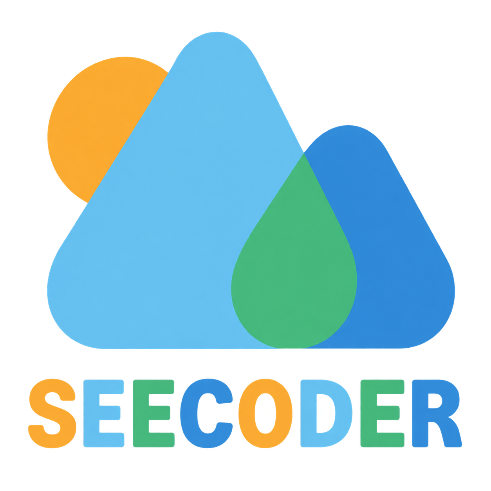
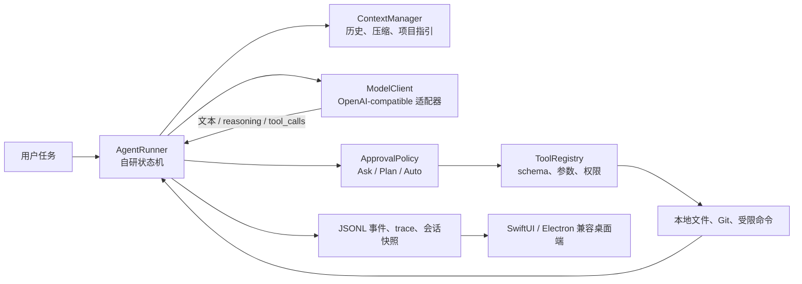

# SEECODER

> 一个本地优先、可审计、可扩展的开源 Coding Agent。

<p align="center">
  
</p>

<p align="center">
  <a href="https://github.com/WANGLEVY9/SEECODER_Version_WANGLEVY9/actions/workflows/ci.yml"></a>
  <a href="https://github.com/WANGLEVY9/SEECODER_Version_WANGLEVY9/releases"></a>
</p>

SEECODER 面向需要真实修改代码的个人开发者和社区贡献者。它把大语言模型当作“下一步行动的建议者”，把文件读写、命令执行、Git 操作、审批和会话状态保留在本地内核中。模型可以提出工具调用，但每个调用都必须经过本地解析、权限判断和执行，再把结果回传给模型继续决策。

- 项目仓库：[WANGLEVY9/SEECODER_Version_WANGLEVY9](https://github.com/WANGLEVY9/SEECODER_Version_WANGLEVY9)
- 默认模型配置：DeepSeek V4 Flash（可替换为其他 OpenAI-compatible 服务）
- 推荐入口：Python CLI + 原生 macOS SwiftUI 桌面端
- 设计原则：本地执行、最小权限、可恢复会话、可追踪事件、失败可解释

### 品牌视觉

SEECODER 图标由橙、天蓝、绿、深蓝四个几何色块组成。仓库内的 `assets/seecoder-logo.png` 是唯一的品牌源文件，SwiftUI 和 Electron 使用其同源副本，避免桌面端和文档出现不一致的标识。界面颜色 token 与图标保持同一套明度关系：

| Token | Hex | 用途 |
| --- | --- | --- |
| `brandAmber` | `#FAA11F` | 新建、提醒、待批准状态 |
| `brandCyan` | `#4DB8EB` | 用户消息、辅助背景 |
| `brandGreen` | `#24B06E` | 成功、本地优先、完成状态 |
| `brandBlue` | `#1A7AD6` | 主操作、链接、运行状态 |
| `ink` | `#1A2E3B` | 正文和代码文字 |
| `canvas` | `#FBFAF7` | 主内容背景 |

## 项目定位

SEECODER 不是某个现成 Agent 产品的界面封装，也不是把代码上传到远程执行服务的薄客户端。一次任务的责任边界如下：

1. 模型只负责理解上下文并提出文本回复或结构化 `tool_call`。
2. AgentRunner 在本地维护消息、步数、上下文、审批和循环终止条件。
3. ToolRegistry 在本地生成工具 schema、解析 JSON 参数、检查工作区边界并分发工具。
4. 文件系统、受限命令、Git 和审计日志均由本机执行或写入。
5. 每一步都以 JSONL 事件和脱敏 trace 表达，桌面端只消费本地事件流。

这使得“模型建议了什么”“本地实际执行了什么”“为何继续、拒绝或停止”可以分开检查。

## 架构总览



外部网络只出现在模型请求或显式 `web_search` 工具中。模型服务不获得本地工作区的隐式访问权，也不替代本地 Agent 循环。

## 能力概览

| 能力 | 当前实现 | 边界 |
| --- | --- | --- |
| 多轮对话 | `chat` 进程持续保存消息、工具结果、usage 与状态，可保存/恢复 JSON 会话 | 会话文件由用户自行管理，不上传云端 |
| 工作模式 | `Ask` 请求批准，`Plan` 只读规划，`Auto Mode` 自动执行允许的本地操作 | 高风险命令仍受白名单和策略限制 |
| 文件协作 | 列目录、读取、搜索、符号发现、写入、补丁、目录重命名、项目概览 | 所有路径必须位于选定工作区，拒绝符号链接逃逸 |
| 命令与 Git | 受限 argv 命令、状态、日志、diff、show，以及可选显式 host shell | 默认不拼接 shell，不是操作系统级沙箱 |
| 模型交互 | 原生 tool-calling、reasoning 内容保留、流式增量、usage 统计、有限重试 | 只适配协议，不托管代码执行 |
| 上下文与记忆 | 历史裁剪、上下文压缩、`SEECODER.md`/`AGENTS.md` 项目指引、Skills 加载 | 指引不能扩大工具权限 |
| 可观测性 | 本地 JSONL 事件、脱敏 trace、工具成功/失败、审批和终止状态 | trace 默认写到工作区外 |
| 桌面端 | SwiftUI 三栏会话界面、实时轨迹、审阅 diff、工具/Skills 面板、可调整布局 | Electron 仅保留兼容实现 |

## 自研实现与关键决策

核心逻辑位于 `src/seecoder/`，没有通过 Agent 框架把控制流隐藏在第三方抽象中。

| 模块 | 自行负责的逻辑 | 为什么这样设计 |
| --- | --- | --- |
| `runner.py` | 多轮循环、步数上限、工具结果回传、连续错误停止、协议错误、超时和 Ctrl+C | 循环终止与失败语义可审计、可测试 |
| `tools/base.py` | Tool Protocol、schema 注册、JSON 参数校验、未知工具处理、异常归一化、工作区边界 | 模型输出不直接变成系统调用 |
| `tools/*` | 文件、补丁、目录重命名、Git、受限命令、搜索、项目概览等本地实现 | 代码和数据留在用户机器，权限集中在工具层 |
| `model_client.py` | 将本地消息和 schema 转为普通 API 请求，解析 `tool_calls`、reasoning、流式 delta 与 usage | 官方客户端只是 HTTP 协议适配器，不拥有 Agent 控制权 |
| `context.py` | token 预算、历史裁剪、项目指引注入、上下文压缩 | 避免把无限历史直接交给模型 |
| `approval.py` | `Ask`/`Plan`/`Auto` 的读写策略、批准请求与危险操作判定 | 策略显式存在，不依赖供应商托管权限 |
| `session.py` | 多轮消息、快照保存、恢复、usage 与步骤状态 | 关闭桌面端后仍可恢复本地会话 |
| `trace.py` | 脱敏 JSONL 审计事件、事件顺序和错误记录 | 便于调试桌面端和复现任务 |
| `desktop/swiftui/` | 原生窗口、会话列表、输入、流式轨迹、环境信息、审阅面板 | UI 只展示本地协议，不重新实现执行内核 |

### 工具调用的本地闭环

模型返回的工具调用只是一段 JSON 数据。AgentRunner 会按以下顺序处理：

1. 校验工具名称和参数结构。
2. 通过 `WorkspaceBoundary` 解析相对路径，检查真实路径和符号链接。
3. 由 `ApprovalPolicy` 判断是否允许当前模式执行。
4. 在本地调用工具并捕获验证、文件系统、进程和内部异常。
5. 把结构化结果写入事件流，追加到上下文，再决定继续、重试或停止。

因此模型不会直接读取文件、修改代码或管理循环；这些职责属于本仓库的本地实现。

## 明确未使用的技术与服务

本项目刻意不依赖以下 Agent 框架、SDK 或托管执行能力：

- LangChain、LangGraph、LlamaIndex
- OpenAI Agents SDK、Claude Agent SDK
- AutoGen、CrewAI 以及同类 Agent 编排框架
- Code Interpreter、Files API、远程代码解释器或托管文件执行服务
- Codex、Claude Code、OpenCode、DeepSeek Harness 等现成 Coding Agent 产品的控制内核

允许使用模型厂商提供的普通 API 客户端和原生 tool-calling 协议，但它们只负责网络请求与响应格式。Agent loop、工具定义与执行、上下文管理、输出解析、审批和错误处理均由 `src/seecoder/` 自行完成。

这不是“完全没有第三方包”：运行时使用官方 `openai` Python 客户端作为兼容 API 适配器，`uv`/`hatchling` 用于环境和打包，SwiftUI/AppKit 用于原生桌面 UI。准确的表述是：**没有 Agent 框架和托管代码执行服务，Agent 内核由本项目实现。**

## 依赖与运行边界

- Python：3.12 或更高版本。
- Python 业务运行时：标准库 + `openai` API 客户端；其余为传递依赖。
- 模型：默认 DeepSeek V4 Flash，可通过 `SEECODER_BASE_URL`、`SEECODER_MODEL` 切换 OpenAI-compatible 服务。
- 原生桌面端：macOS 14+、Swift 6、SwiftUI/AppKit 系统框架。
- Electron 端：`desktop/electron/` 是兼容展示层，不承载 Agent 内核，也不是推荐入口。
- 所有本地工具都接收显式工作区；trace、会话快照和凭据文件不应放入工作区或 Git。

## 快速开始

### 1. 安装

```bash
git clone https://github.com/WANGLEVY9/SEECODER_Version_WANGLEVY9.git
cd SEECODER_Version_WANGLEVY9
uv sync
cp .env.example .env
```

在 `.env` 中填写自己的 `SEECODER_API_KEY`。仓库只提供变量名和示例值，不应写入真实密钥：

```dotenv
SEECODER_BASE_URL=https://api.deepseek.com
SEECODER_MODEL=deepseek-v4-flash
SEECODER_THINKING_MODE=disabled
SEECODER_API_KEY=replace-with-your-key
```

程序只从进程环境或未入库的 dotenv 文件读取密钥。不会打印 API key 或请求头，`.env`、trace、录屏和虚拟环境已被 `.gitignore` 排除。

### 2. CLI 单任务

```bash
uv run seecoder run "检查项目结构并运行测试，若失败给出最小修复" \
  --workspace demo_workspace \
  --mode auto
```

### 3. CLI 多轮会话

```bash
uv run seecoder chat \
  --workspace demo_workspace \
  --mode ask \
  --save /private/tmp/seecoder-session.json
```

可用 `uv run seecoder --help`、`uv run seecoder run --help` 和 `uv run seecoder chat --help` 查看参数。`--resume` 恢复已有快照，`--event-json` 输出桌面端使用的本地 JSONL 事件，`--trace-dir` 指定工作区外的审计目录，`--max-steps` 限制单次循环步数。

三种模式的语义如下：

- **Ask**：只读操作可直接执行，写文件、重命名和命令等变更操作会等待用户批准。
- **Plan**：执行只读检查并返回计划，不执行变更。
- **Auto Mode**：在本地安全策略允许范围内自动执行，仍受工作区边界、命令白名单和步数上限约束。

## 原生 macOS 桌面端

推荐启动 SwiftUI 原生端：

```bash
./desktop/run_desktop_native.sh
```

脚本会先构建临时 `.app` 包，再以前台方式启动包内可执行文件。这样启动错误会直接显示在当前终端，`Ctrl-C` 也只会停止本次开发实例；脚本同时设置 `SEECODER_PROJECT_ROOT`，保证 Git、AgentRunner 和会话状态都以仓库根目录为基准。若此前通过旧脚本启动过实例，请先关闭旧窗口，再重新执行该命令。

桌面端通过本地 `Process` 连接一个持续运行的 `seecoder chat`，因此同一会话可以连续提交多轮任务。当前界面提供：

- 会话列表、会话重命名、工作区选择和新建工作区。
- 固定底部输入框、流式 Markdown 消息、模型思考/工具轨迹和停止按钮。
- 运行状态、审批操作、环境信息、Git 分支与变更统计。
- 已编辑文件卡片，点击后进入本地 diff 审阅；工具/MCP 注册信息与项目 Skills 状态面板。
- 可调整的会话、内容、审阅三栏布局；关闭窗口后可从本地会话快照恢复。

桌面端不加载远程网页、不使用远程 UI 服务，也不读取或显示 API key。SwiftUI 不可用时，可使用 Tk 兼容端 `./desktop/run_desktop.sh`；Electron 兼容端位于 `desktop/electron/`，更新后需完全退出并重新启动。

## 工具与扩展

当前工具注册表覆盖常见编程工作流：

- **理解项目**：`list_files`、`find_files`、`read_file`、`search_files`、`search_code`、`project_overview`。
- **修改文件**：`write_file`、`apply_patch`、`rename_directory`。
- **验证变更**：`run_command`、`git_diff`、`git_status`、`git_log`、`git_show`。
- **Agent 辅助**：有界的 `spawn_agent`、可失败降级的 `web_search`。
- **本地 Skills**：`list_skills` 读取 `.seecoder/skills/<name>/SKILL.md`，仅提供项目指引。

新增工具应实现本地 Tool Protocol，声明名称、描述、参数 schema、只读/变更属性和执行函数，再注册到 `ToolRegistry`。工具不能绕过 `WorkspaceBoundary`、审批策略、命令限制或 trace。当前系统不要求外部 MCP 服务才能运行；桌面端的工具/MCP 面板用于展示本地注册能力和连接状态，外部服务必须由用户显式配置并遵守同一权限边界。

## 安全模型与限制

- **工作区边界**：路径经过规范化和真实路径检查，拒绝越出根目录、系统目录、凭据文件和符号链接目标。
- **命令限制**：默认使用固定 argv 和白名单，不把用户输入拼成 shell 字符串。`--host-shell` 是显式兼容选项，不代表 OS 级沙箱。
- **审批策略**：Ask、Plan、Auto 的行为由本地策略决定；高风险或不明确的操作应停下等待确认。
- **凭据隔离**：`.env`、trace 和会话快照不自动放入工作区，不在事件中记录密钥和请求头。
- **可停止性**：步数、连续工具错误、协议错误、超时和 Ctrl+C 都有明确终止状态。

SEECODER 是开发辅助工具，不是完整的操作系统安全隔离环境。运行前仍应使用专用工作区、版本控制和备份，并审阅即将执行的命令。

## 验证与开发

测试使用本地 fake model，不需要真实 API key。推荐在仓库根目录执行：

```bash
UV_CACHE_DIR=/private/tmp/seecoder-uv-cache \
  uv run python -m unittest discover -s tests -v

UV_CACHE_DIR=/private/tmp/seecoder-uv-cache \
  uv run python -m compileall -q src

(cd desktop/swiftui && \
  CLANG_MODULE_CACHE_PATH=/private/tmp/seecoder-swift-module-cache \
  swift build)

(cd desktop/electron && npm test)
```

最近一次离线回归基线为 Python 后端 **75/75**，SwiftUI 原生端编译通过；Electron 与 Tk 兼容端分别提供边界和启动测试。真实模型、网络搜索和宿主命令的结果取决于本机配置，不能用离线 fake model 代替声明为端到端验证。

## CI/CD 流水线

`.github/workflows/ci.yml` 在每次 Pull Request、`main` 推送或手动触发时运行：

- Python 3.12/3.13 锁定依赖、75 项后端回归、Tk 边界测试、编译检查和包构建。
- Node.js 22.12 的 Electron `npm ci` 与 8 项兼容端测试。
- macOS 14 上的 SwiftUI 构建和品牌资源检查。
- README 语境审计、`git diff --check`、品牌资产一致性和凭据样式扫描。

推送形如 `v1.0.0` 的 Git tag 会触发 `.github/workflows/release.yml`，构建 Python wheel/sdist、未签名的 macOS `.app` 压缩包和 Electron 兼容端源码包，并自动生成 GitHub Release。macOS 包目前未配置开发者证书和 notarization，发布到生产环境前应由维护者补充签名流程。

```bash
git tag v0.1.0
git push origin v0.1.0
```

## 仓库结构

```text
src/seecoder/
├── runner.py          # AgentRunner 自研循环
├── model_client.py    # OpenAI-compatible 协议适配
├── context.py         # 上下文预算、裁剪和项目指引
├── approval.py        # Ask / Plan / Auto 策略
├── session.py         # 多轮会话与快照
├── trace.py           # 脱敏 JSONL 事件
└── tools/             # 本地工具、注册表和工作区边界
desktop/
├── swiftui/           # 推荐的原生 macOS 桌面端
├── electron/          # 兼容展示层
└── run_desktop*.sh    # 启动脚本
assets/
└── seecoder-logo.png  # 品牌源图标（SwiftUI/Electron 同源）
tests/                 # 后端、工具、协议和安全边界测试
docs/                  # 架构、边界和验证记录
demo_workspace/        # 可复现实例工作区
```

## 路线图

已完成的基础能力包括本地 Agent 循环、工具注册与执行、三种模式、上下文和会话持久化、JSONL 事件、文件/Git 工具、SwiftUI 桌面端、diff 审阅和项目 Skills。

后续社区贡献优先级：

1. 增加更多只读代码分析器和语言无关的验证工具。
2. 完善不同模型协议的适配测试，保持 Agent 内核与供应商解耦。
3. 扩展桌面端布局、键盘可达性、主题和跨平台打包。
4. 增加工具权限、长任务恢复和大仓库上下文压缩的基准。
5. 为外部 MCP 连接设计显式、可撤销、可审计的权限适配层，而不是把服务直接注入核心循环。

欢迎通过 Issue 或 Pull Request 提交问题、测试用例和工具实现。任何新能力都应同时说明权限边界、失败行为、测试证据和对本地数据的影响。

## 贡献与许可

提交代码前请运行上述离线测试、编译检查和 `git diff --check`，并在 PR 中说明变更范围。仓库是否采用何种开源许可证以根目录实际的 `LICENSE` 文件为准；在许可证文件存在前，请不要把代码重新发布为带有额外许可承诺的衍生产品。
